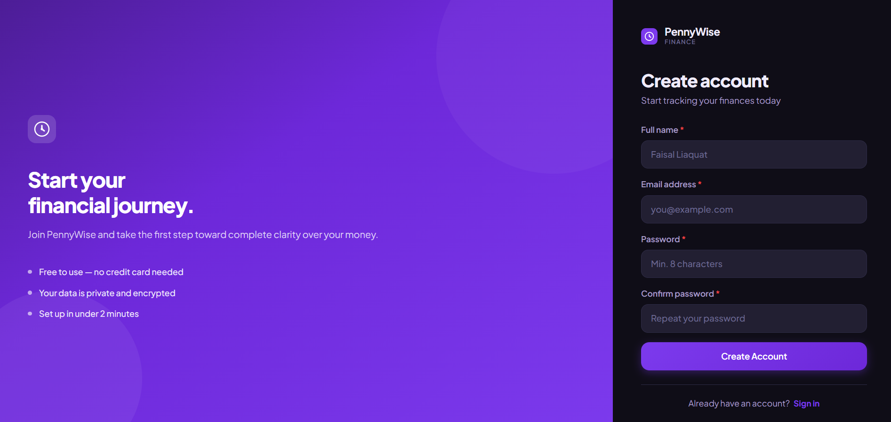
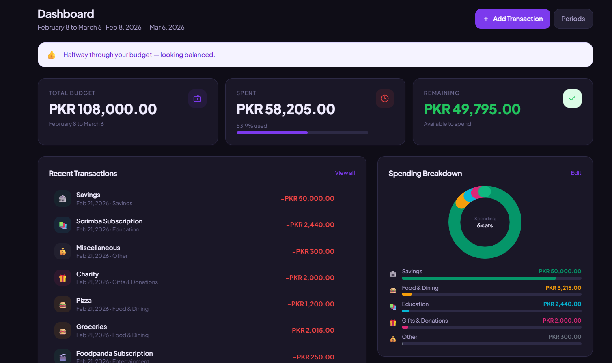
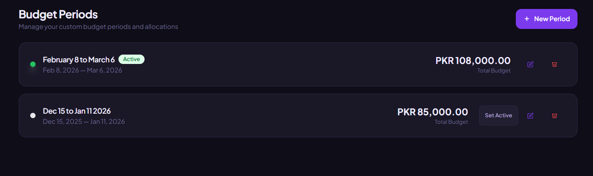
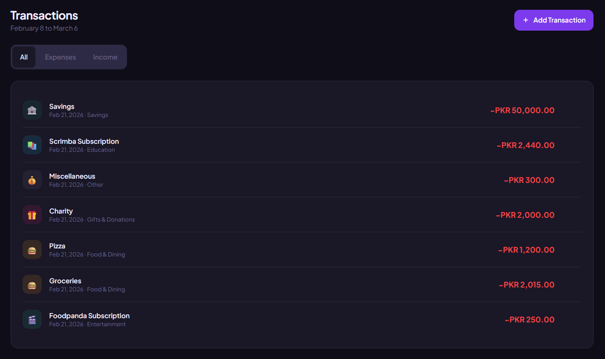
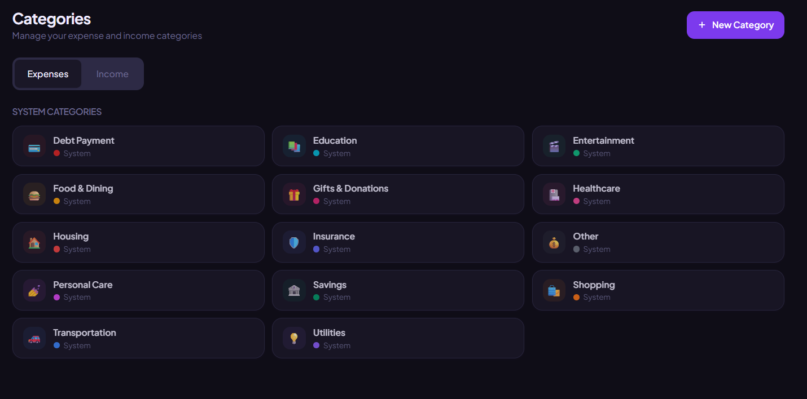
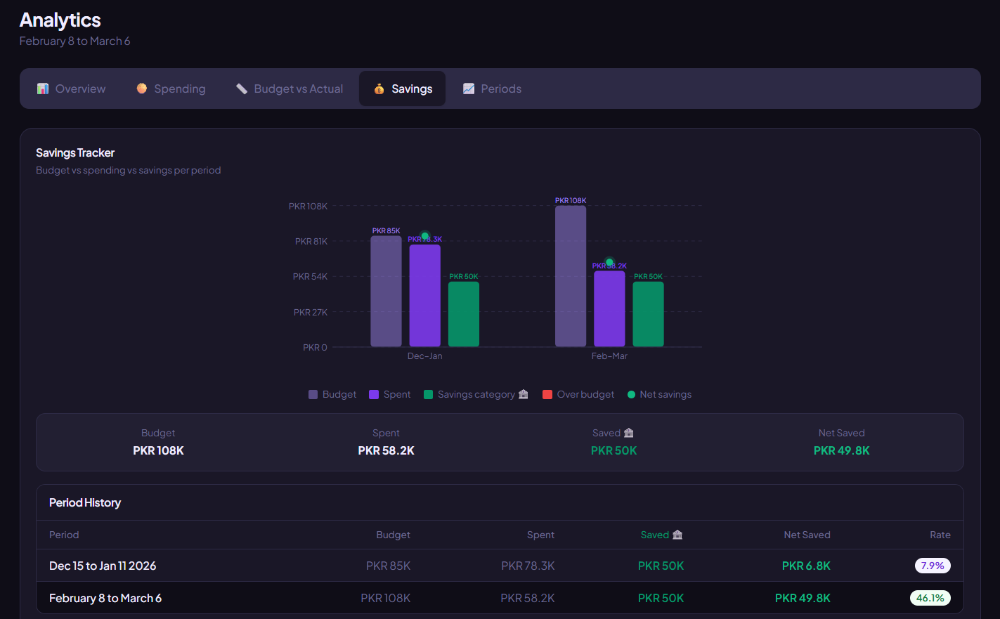

# 💜 PennyWise

> A clean, minimalist personal finance tracker. Track budgets, expenses, and income across custom date periods — your way.









---

## ✨ Features

- **Custom Budget Periods** — Define any date range (e.g. Dec 15 – Jan 15), not just calendar months
- **Smart Budget Tracking** — Net balance model: Budget + Income − Expenses = Remaining
- **21 Pre-built Categories** — 14 expense + 7 income categories, plus create your own
- **Analytics & Charts** — 5 SVG-based chart views: Overview, Spending Breakdown, Budget vs Actual, Savings Tracker, Period Comparison
- **Dark Mode** — Full dark/light theme with localStorage persistence
- **Multi-currency Support** — Global currency selection per user profile
- **Secure by Default** — Row Level Security on all tables; users only see their own data
- **Input Validation** — Two-layer validation (client + database constraints)
- **Rate Limiting** — Client-side protection against rapid submissions

---

## 🛠 Tech Stack

| Layer      | Technology                         |
| ---------- | ---------------------------------- |
| Frontend   | Svelte 5 + Vite 7                  |
| Styling    | Tailwind CSS 3                     |
| Backend    | Supabase (PostgreSQL)              |
| Auth       | Supabase Auth                      |
| Database   | PostgreSQL with Row Level Security |
| Deployment | Vercel                             |

---

## 🚀 Quick Start

### Prerequisites

- Node.js 20.x or higher
- npm
- Supabase account (free tier works)

### 1. Clone the Repository

```bash
git clone https://github.com/YOUR_USERNAME/pennywise.git
cd pennywise
```

### 2. Install Dependencies

```bash
npm install
```

### 3. Set Up Environment Variables

```bash
# Windows
copy .env.example .env

# Mac/Linux
cp .env.example .env
```

Edit `.env`:

```env
VITE_SUPABASE_URL=https://YOUR_PROJECT_ID.supabase.co
VITE_SUPABASE_ANON_KEY=your_anon_public_key_here
```

> ⚠️ Use the **anon public** key from Supabase → Settings → API. Never use the service_role key in browser code.

### 4. Set Up the Database

Run these SQL files in your Supabase **SQL Editor** (in order):

1. `supabase/migrations/001_initial_schema.sql`
2. `supabase/migrations/002_seed_data.sql`
3. `supabase/migrations/003_security_audit.sql`

Full guide: [docs/ENV_SETUP.md](docs/ENV_SETUP.md)

### 5. Run the Dev Server

```bash
npm run dev
```

Open [http://localhost:5173](http://localhost:5173)

---

## 📁 Project Structure

```
pennywise/
├── docs/
│   ├── DATABASE_SCHEMA.md       # Full DB schema docs
│   ├── DEPLOYMENT.md            # Vercel deployment guide
│   ├── ENV_SETUP.md             # Environment variable setup
│   └── SECURITY.md              # Security audit documentation
├── src/
│   ├── lib/
│   │   ├── components/          # Reusable UI components
│   │   │   ├── analytics/       # Chart components (5 SVG charts)
│   │   │   ├── layout/          # AppLayout, Sidebar, Header
│   │   │   └── ui/              # Button, Input, Modal, etc.
│   │   ├── stores/              # Svelte stores (auth, budget, theme)
│   │   └── utils/               # validators, sanitize, rateLimiter
│   ├── routes/                  # Page components
│   │   ├── Dashboard.svelte
│   │   ├── Transactions.svelte
│   │   ├── Categories.svelte
│   │   ├── Analytics.svelte
│   │   └── Settings.svelte
│   ├── App.svelte               # Root component with routing
│   ├── app.css                  # Global styles
│   └── main.js                  # Entry point
├── supabase/
│   └── migrations/              # SQL migration files
│       ├── 001_initial_schema.sql
│       ├── 002_seed_data.sql
│       └── 003_security_audit.sql
├── .env.example                 # Environment variable template
├── .gitignore
├── index.html
├── package.json
├── tailwind.config.js
└── vite.config.js
```

---

## 🗄️ Database Schema

Four tables with full Row Level Security:

| Table            | Description                                  |
| ---------------- | -------------------------------------------- |
| `profiles`       | Extended user profile (currency, name, etc.) |
| `budget_periods` | Custom date-range budget periods             |
| `categories`     | System + user-defined transaction categories |
| `transactions`   | All income and expense records               |

Full schema: [docs/DATABASE_SCHEMA.md](docs/DATABASE_SCHEMA.md)

---

## 🔒 Security

- **Row Level Security** on all 4 tables — users only access their own data
- **Input validation** — client-side (validators.js) + DB constraints (migration 003)
- **XSS protection** — all text inputs sanitized before DB insert; Svelte auto-escapes templates
- **SQL injection prevention** — Supabase's parameterized query API only (no raw SQL strings)
- **Rate limiting** — client-side limits on login (5/5min), register (3/10min), transactions (20/min)
- **Anon key only** — service_role key never used in browser

Full audit: [docs/SECURITY.md](docs/SECURITY.md)

---


## 🧰 Development Commands

```bash
# Start development server
npm run dev

# Build for production
npm run build

# Preview production build locally
npm run preview
```

---

## 🌐 Deployment

Deployed on Vercel — see [docs/DEPLOYMENT.md](docs/DEPLOYMENT.md) for the full step-by-step guide.

---

## 📜 License

MIT — feel free to use this as a base for your own finance tracker.

---

Built with 💜 using Svelte + Supabase by Faisal Liaquat :)
